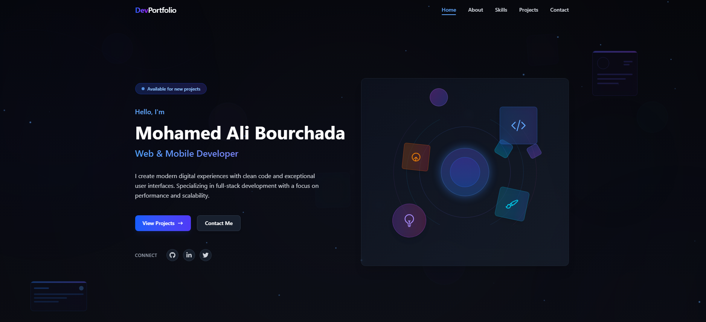

# Full-Stack Developer Portfolio

A modern Single Page Application (SPA) portfolio for a Full-Stack Web & Mobile Developer built with Next.js and Tailwind CSS.

## Preview



## Features

- 🌙 Dark/Light mode toggle
- 📱 Fully responsive design
- 🎨 Modern UI inspired by admin dashboards
- 🚀 Smooth scroll navigation
- ✨ Subtle animations with Framer Motion
- 📊 Skills visualization
- 📁 Project showcase
- 📧 Dynamic contact form powered by EmailJS
- ✅ Form validation and submission feedback

## Tech Stack

- Next.js (App Router)
- TypeScript
- Tailwind CSS
- Framer Motion
- React Icons
- EmailJS for form handling

## Getting Started

### Prerequisites

- Node.js 18+ and npm
- EmailJS account for contact form functionality

### Installation

1. Clone the repository:

   ```bash
   git clone https://github.com/Mohamed-Ali-Bourchada/portfolio.git
   cd portfolio
   ```

2. Install dependencies:

   ```bash
   npm install
   ```

3. Set up EmailJS:

   - Create an account on [EmailJS](https://www.emailjs.com/)
   - Create a new Email Service (Gmail, Outlook, etc.)
   - Create an Email Template with variables: `{{from_name}}`, `{{email}}`, `{{subject}}`, `{{message}}`
   - Update the EmailJS credentials in `src/components/sections/Contact.tsx`:

     ```typescript
     // Initialize EmailJS once on component mount
     useEffect(() => {
       emailjs.init("YOUR_PUBLIC_KEY");
     }, []);

     // Update service ID and template ID
     const result = await emailjs.sendForm(
       "YOUR_SERVICE_ID",
       "YOUR_TEMPLATE_ID",
       formRef.current,
       "YOUR_PUBLIC_KEY"
     );
     ```

4. Run the development server:

   ```bash
   npm run dev
   ```

5. Open [http://localhost:3000](http://localhost:3000) in your browser to see the result.

## Project Structure

```
portfolio/
├── public/            # Static assets
├── src/
│   ├── app/           # App router pages
│   ├── components/    # React components
│   │   ├── layout/    # Layout components
│   │   ├── sections/  # Page sections
│   │
│   |
├── tailwind.config.ts # Tailwind configuration
└── README.md          # Project documentation
```

## Customization

1. Update personal information in the components
2. Replace project images in the `public/projects` directory
3. Add your own profile picture as `public/profile.jpg`
4. Customize colors in `tailwind.config.ts` and `globals.css`
5. Edit the EmailJS template to change the email design

## Deployment

This project can be easily deployed to Vercel:

```bash
npm install -g vercel
vercel
```

## License

This project is licensed under the MIT License - see the LICENSE file for details.
